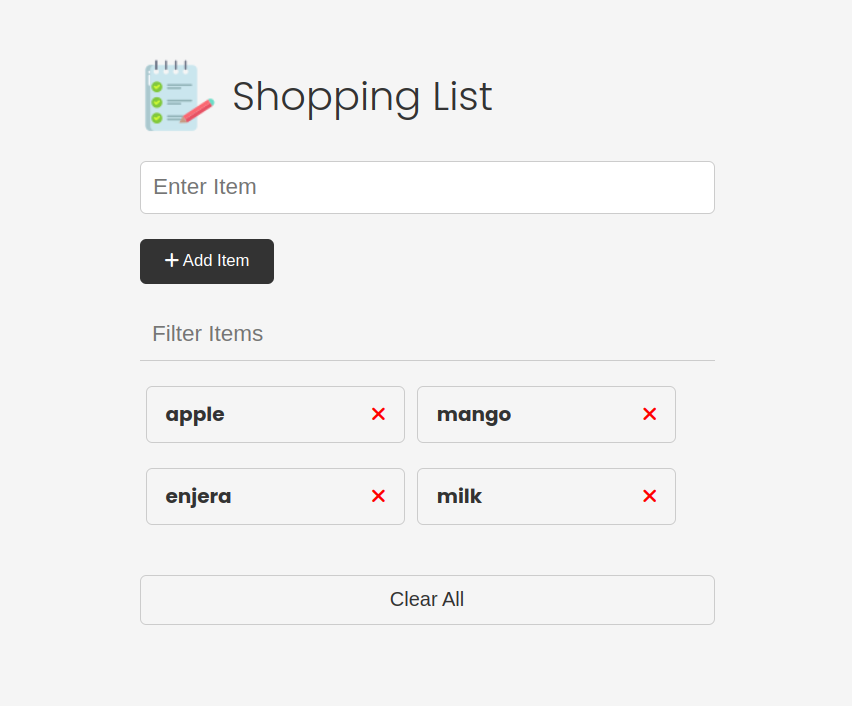

# Shopping List Web App

A simple web application built with HTML, CSS, and JavaScript for managing a dynamic shopping list. Users can add, edit, and remove items from the list, which persists using local storage. The interface supports filtering items and provides a responsive design for various screen sizes.

## Features
- **Add Item:** Enter new items to be added to the list.
- **Edit Item:** Click on an item to edit its content inline.
- **Remove Item:** Remove items individually with confirmation.
- **Filter Items:** Search and filter items based on their names.
- **Local Storage:** Items persist even after refreshing the page using browser local storage.

## Technologies Used
- HTML
- CSS
- JavaScript

## Installation
1. Clone the repository.
2. Open `index.html` in your web browser.

## Usage
- Start managing your shopping list directly in the browser.

## Screenshots

## Contributing
Pull requests are welcome. For major changes, please open an issue first to discuss what you would like to change.

